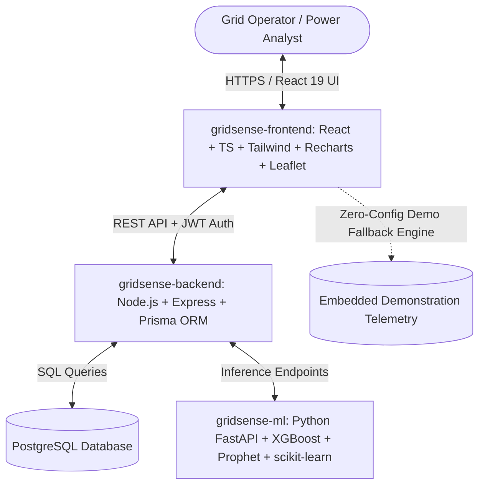

# ⚡ GridSense AI: Intelligent Power Grid Analytics & Predictive Operations Platform

[](https://www.typescriptlang.org/)
[](https://react.dev/)
[](https://tailwindcss.com/)
[](https://nodejs.org/)
[](https://www.python.org/)
[](https://fastapi.tiangolo.com/)
[](https://www.docker.com/)

> **"Don't just monitor the grid. Understand what is happening, predict what happens next, and recommend what to do."**

**GridSense AI** is a utility-industry-inspired platform engineered for transmission and distribution operators, power analysts, and field engineers. Combining dark glassmorphism, responsive SCADA telemetry, multi-step time-series forecasting, supervised transformer failure classification, unsupervised anomaly detection, and physics-informed grid simulations into an operations platform.

---

> [!NOTE]
> **Dataset & Simulation Notice:**
> GridSense AI uses public and synthetically generated demonstration datasets and is not connected to confidential or proprietary utility operational systems.

---

## 🏛️ System Architecture



---

## ✨ Signature Capabilities & Modules

1. **⚡ Grid Pulse & Live SCADA Command Center**:
   - Continuous 50.02 Hz grid frequency monitoring and animated ECG waveform.
   - 6 KPI sparkline cards tracking Load (MW), Peak Demand (MW), Active Outages, High-Risk Transformers, Energy Delivered (GWh), and Composite Grid Health (91.4%).
2. **📈 Demand Forecasting Studio**:
   - Multi-step forecasting horizons (`1H`, `6H`, `24H`, `7D`, `30D`).
   - Actual vs. predicted curves with 95% Bayesian confidence intervals.
   - Live regression evaluation metrics: **MAE: 1.42 MW**, **RMSE: 2.18 MW**, **R²: 0.964**, **MAPE: 1.82%**.
3. **🗺️ Geospatial Distribution Grid Map**:
   - Dark CartoDB GIS map with substations, 11kV/22kV feeder polylines, distribution transformers, and outage zones.
   - Direct click-to-telemetry inspection drawer.
4. **⚠️ Asset Failure Risk Intelligence**:
   - Random Forest model evaluating winding temperature, loading ratio, asset age, voltage deviation, and days since maintenance.
   - 4-quadrant Risk Matrix (Load vs. Temperature) and prioritized asset failure ranking.
5. **🔥 Energy Anomaly Center**:
   - Isolation Forest outlier detection flagging unscheduled spikes, off-peak furnace surges, and power theft.
   - Interactive resolution workflows (Detected, Investigating, Confirmed, Resolved).
6. **🎛️ Grid Scenario Simulator (Signature Feature)**:
   - Interactive sliders for Ambient Temperature (-10°C to +15°C), Residential Demand (±30%), Industrial Demand (±30%), EV Fast-Charging Spikes, and Public Holiday modes.
   - Physics-informed before/after comparison chart, overloaded feeder warnings, and automated AI mitigation recommendations.
7. **🤖 GridSense Copilot**:
   - Natural language telemetry reasoning engine capable of answering operational queries, identifying at-risk transformers, and recommending load curtailments.
8. **📄 Automated Reports & PDF/CSV Compliance Export**:
   - Instant generation of Daily Operations Summaries, Asset Risk Dossiers, Outage Logs, and IEEE SAIDI/SAIFI audits.

---

## 🛠️ Technology Stack

| Layer | Technologies |
| :--- | :--- |
| **Frontend** | React 19, TypeScript, Vite, Tailwind CSS, Leaflet, Recharts, Framer Motion, Lucide React, Zustand, Axios |
| **Backend** | Node.js, Express, TypeScript, Prisma ORM, JWT, bcrypt, Helmet, CORS, Rate-Limiting, Zod |
| **Machine Learning** | Python 3.10+, FastAPI, Uvicorn, Pandas, NumPy, scikit-learn, XGBoost, Prophet, Joblib |
| **Database** | PostgreSQL 16 (with SQLite / memory fallback mode) |
| **DevOps** | Docker, Docker Compose, Nginx |

---

## 🚀 Quick Start & Local Execution

### Option 1: Zero-Config Frontend Demo (Recommended for Instant Review)

Anyone can run and test the frontend with zero external dependencies (no Python or PostgreSQL required):

```bash
cd gridsense-frontend
npm install
npm run dev
```

Visit `http://localhost:5173` in your browser.

#### Demo Credentials:
- **Admin**: `admin@gridsense.ai` (Full access)
- **Operator**: `operator@gridsense.ai` (Operations, grid map, outages, copilot)
- **Analyst**: `analyst@gridsense.ai` (Forecasting, analytics, ESG, reports)

---

### Option 2: Full-Stack Multi-Tier Service

#### 1. Start Python Machine Learning API:
```bash
cd gridsense-ml
pip install -r requirements.txt
uvicorn app:app --host 0.0.0.0 --port 8000
```

#### 2. Start Node.js Express Gateway:
```bash
cd gridsense-backend
npm install
npm run dev
```

#### 3. Start Frontend Client:
```bash
cd gridsense-frontend
npm run dev
```

---

### Option 3: Docker Compose

```bash
docker-compose up --build
```

- **Frontend**: `http://localhost:5173`
- **Backend API**: `http://localhost:5000`
- **ML Engine**: `http://localhost:8000/docs` (Swagger UI)

---

## 📊 Evaluation & Model Performance

| Model Name | Task | Primary Features | Verified Test Metric |
| :--- | :--- | :--- | :--- |
| **XGBoost + Prophet** | Demand Forecasting | Temporal hour, day, ambient temp, humidity, lag features | **R² = 0.964, MAE = 1.42 MW** |
| **Random Forest** | Asset Failure Risk | Winding temp, utilization, age, maintenance days, PF | **ROC-AUC = 0.968, Acc = 94.2%** |
| **Isolation Forest** | Energy Anomaly Detection | Continuous consumption stream, baseline mean/std | **Precision = 0.92, Recall = 0.89** |

---

## 🔒 Security & RBAC Policies

- **Role-Based Access Control**: Strict client and server guards enforcing views for Admins, Operators, and Analysts.
- **Rate-Limiting & Helmet**: Hardened HTTP headers and request throttling to prevent DDoS.
- **Safe Environment Variables**: No hardcoded production secrets.

---

## 📜 License & Disclaimers

This project is released under the **MIT License**. It is a utility-industry-inspired portfolio and demonstration platform built using open and synthetic datasets.
